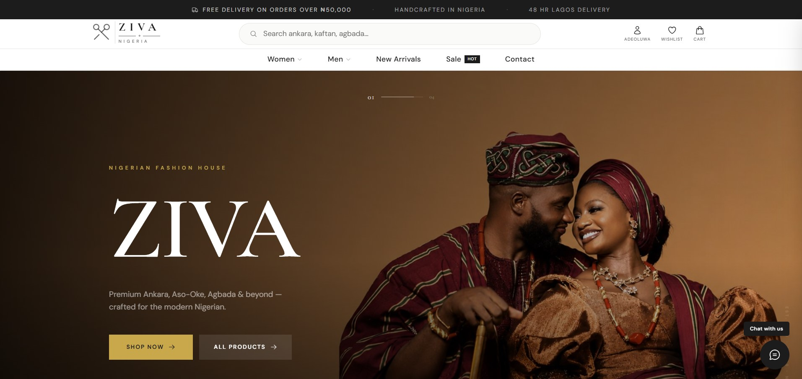
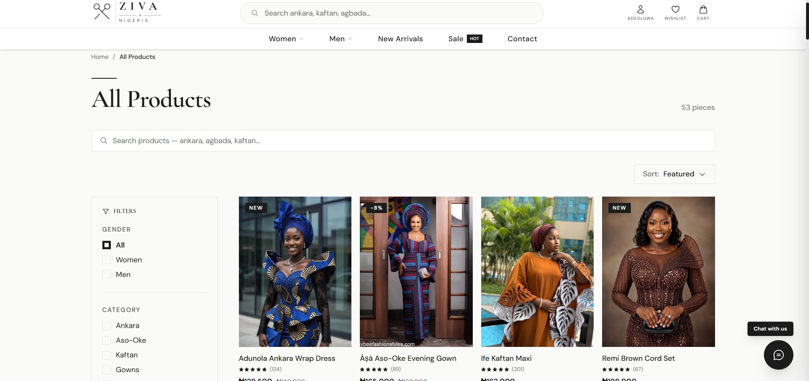
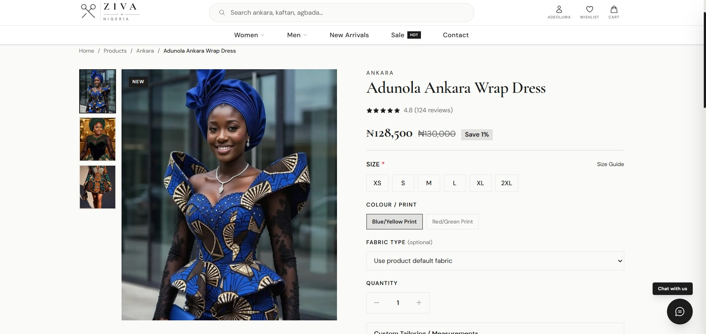
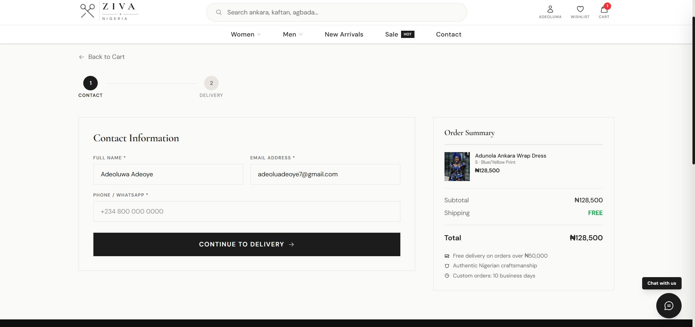

# ZIVA Fashion — Premium Nigerian Fashion E-Commerce

ZIVA is a full-stack e-commerce platform for premium Nigerian fashion, built with Next.js 14 App Router. It serves as a digital storefront for authentic Nigerian attire — Ankara, Aso-Oke, Agbada, Senator, Kaftan, Adire, and more — designed in Lagos and worn worldwide.

---

## Screenshots

<div align="center">
  
  
  
  
</div>

---

## Tech Stack

| Layer | Technology |
|---|---|
| Framework | Next.js 14 (App Router, RSC) |
| Language | TypeScript |
| Styling | Tailwind CSS v4 |
| Database | MongoDB (via Mongoose / native driver) |
| Authentication | Clerk |
| Payments | Paystack |
| Email | Nodemailer (SMTP) |
| PDF Generation | @react-pdf/renderer |
| Icons | react-icons (Phosphor, Font Awesome 6) |
| Image Optimization | Next.js Image component |
| Fonts | Playfair Display (headings), DM Sans (body) |

---

## Features

### Storefront
- **Hero Slideshow** — Full-screen auto-advancing carousel with 4 slides (Nigerian Fashion House, Women, Men, New Arrivals). Custom thick-arrow navigation, progress bar, animated text entries.
- **Trust Strip** — Clean 4-column feature bar (Free Delivery, Secure Payment, Loyalty Rewards, 24/7 Support). Appears on the landing page and products page.
- **Shop Categories** — 2×2 image grid linking to Women, Men, New Arrivals, and Sale collections. Full-height tiles with overlay labels and reveal CTAs.
- **Marquee Strip** — Horizontal scrolling ticker with brand keywords.
- **Featured Products** — 8-product grid of curated items with ProductCard components.
- **Brand Story** — Editorial section with heritage narrative.
- **Testimonials** — Customer review section.
- **Recently Viewed** — Client-side session-persistent list of recently browsed products.

### Product Catalogue (`/products`)
- Full product listing with server-side data fetch from `/api/products`
- Filter by gender, category, price range, and collection tags (new / sale)
- Full-text search across name, category, and description
- Sort by featured, newest, price (asc/desc), and rating
- Slide-in mobile filter drawer
- Active filter pills with individual and bulk clear
- Trust strip banner at page top

### Product Detail (`/products/[id]`)
- Full product detail with image gallery
- Size selection, custom tailoring option with measurements input
- Add to cart / Add to wishlist
- Related products
- Sticky add-to-cart panel on desktop

### Cart (`/cart`)
- Real-time cart state via Zustand store (persisted to localStorage)
- Quantity adjustment and line-item removal
- Order summary with subtotal, delivery fee, and total
- Checkout flow link

### Checkout (`/checkout`)
- Paystack payment integration
- Order confirmation and email receipt trigger
- PDF invoice generation on successful payment

### Account (`/account`)
- Clerk-powered authentication (sign in / sign up / social login)
- Order history
- Profile management

### Wishlist (`/wishlist`)
- Persistent wishlist stored in Zustand (localStorage)
- Add / remove from any product card or detail page

### Help Centre (`/help`)
- Accordion FAQ (8 questions covering delivery, returns, payments, tailoring, etc.)
- Quick contact cards: Live Chat, WhatsApp, Email
- Support hours panel
- Quick links sidebar

### Contact (`/contact`)
- Contact form wired to MongoDB `contacts` collection
- Sends notification email to admin on submission

### Live Chat
- Floating chat widget available on all pages
- Customer initiates chat with name + opening message
- Real-time polling for admin replies (3-second interval)
- Unread badge on widget icon
- Admin dashboard manages all conversations

---

## Admin Dashboard (`/admin`)

> Protected route — Clerk session required with admin role.

- **Overview** — KPI cards: total orders, revenue, customers, new messages
- **Orders** — Full order table with status management (pending → processing → shipped → delivered)
- **Products** — Product CRUD: add, edit, delete with image URL management
- **Customers** — Customer list with order count and total spend
- **Live Chat** — Chat inbox with all open/closed conversations, real-time reply panel
- **Newsletter** — Subscriber list and broadcast email tool
- **Analytics** — Revenue chart, top products, traffic by page (recent visits)

---

## API Routes

| Route | Method | Description |
|---|---|---|
| `/api/products` | GET | Fetch all products (supports filters) |
| `/api/products/[id]` | GET, PUT, DELETE | Product CRUD |
| `/api/orders` | GET, POST | Order listing and creation |
| `/api/orders/[id]` | GET, PATCH | Order detail and status update |
| `/api/customers` | GET | Customer list |
| `/api/customers/[id]` | GET | Customer detail with orders |
| `/api/chats` | GET, POST | Chat listing and creation |
| `/api/chats/[id]/messages` | POST | Send a chat message |
| `/api/newsletter` | POST | Subscribe to newsletter |
| `/api/newsletter/broadcast` | POST | Send broadcast email to all subscribers |
| `/api/contact` | POST | Submit contact form |
| `/api/analytics/visit` | POST | Track page visit |
| `/api/paystack/webhook` | POST | Handle Paystack payment events |
| `/api/invoice/[orderId]` | GET | Generate and stream PDF invoice |
| `/api/admin/...` | Various | Admin-protected endpoints |

---

## Project Structure

```
src/
├── app/
│   ├── layout.tsx              # Root layout (Header, Footer, Chat widget)
│   ├── page.tsx                # Home / Landing page
│   ├── products/
│   │   ├── page.tsx            # Products listing (SSR shell)
│   │   ├── ProductsClient.tsx  # Client-side filter/sort/search UI
│   │   └── [id]/               # Product detail page
│   ├── cart/page.tsx
│   ├── checkout/page.tsx
│   ├── account/page.tsx
│   ├── wishlist/page.tsx
│   ├── help/page.tsx
│   ├── contact/page.tsx
│   ├── auth/page.tsx
│   ├── admin/
│   │   ├── page.tsx            # Admin dashboard
│   │   └── products/page.tsx
│   ├── support/page.tsx
│   └── api/                    # All API routes
│
├── components/
│   ├── Header.tsx
│   ├── Footer.tsx
│   ├── Logo.tsx
│   ├── ProductCard.tsx
│   ├── MiniCart.tsx
│   ├── MobileMenu.tsx
│   ├── ChatWidget.tsx
│   ├── TrustStrip.tsx          # Trust signals bar (landing + products)
│   ├── Toast.tsx
│   ├── RevealObserver.tsx      # IntersectionObserver for scroll animations
│   ├── StoreHydration.tsx
│   └── home/
│       ├── HeroSection.tsx
│       ├── ShopCategories.tsx
│       ├── FeaturedProducts.tsx
│       ├── MarqueeStrip.tsx
│       ├── BrandStory.tsx
│       ├── Testimonials.tsx
│       ├── BentoGrid.tsx
│       └── RecentlyViewed.tsx
│
├── lib/
│   ├── mongodb.ts              # MongoDB connection singleton
│   ├── products.ts             # Product data helpers
│   ├── invoice.tsx             # PDF invoice renderer
│   └── ...
│
└── types/
    └── index.ts                # Shared TypeScript types
```

---

## Getting Started

### Prerequisites
- Node.js 18+
- A MongoDB connection string (MongoDB Atlas or local)
- A Clerk account (for auth)
- A Paystack account (for payments)
- SMTP credentials (for email)

### Environment Variables

Create a `.env.local` file in the root:

```env
# MongoDB
MONGODB_URI=mongodb+srv://...

# Clerk
NEXT_PUBLIC_CLERK_PUBLISHABLE_KEY=pk_...
CLERK_SECRET_KEY=sk_...
NEXT_PUBLIC_CLERK_SIGN_IN_URL=/auth
NEXT_PUBLIC_CLERK_SIGN_UP_URL=/auth

# Paystack
NEXT_PUBLIC_PAYSTACK_PUBLIC_KEY=pk_...
PAYSTACK_SECRET_KEY=sk_...

# Email (SMTP)
SMTP_HOST=smtp.example.com
SMTP_PORT=465
SMTP_USER=hello@ziva.ng
SMTP_PASS=...
EMAIL_FROM="ZIVA Fashion <hello@ziva.ng>"
ADMIN_EMAIL=admin@ziva.ng

# App
NEXT_PUBLIC_BASE_URL=http://localhost:3000
```

### Development

```bash
npm install
npm run dev
```

Open [http://localhost:3000](http://localhost:3000).

### Production Build

```bash
npm run build
npm start
```

---

## Design System

### Colors
| Token | Value | Usage |
|---|---|---|
| `ziva-black` | `#1C1C1C` | Primary text, buttons |
| `ziva-cream` | `#FAFAF8` | Page background |
| `ziva-muted` | `#6B6B6B` | Secondary text |
| `ziva-border` | `#E8E4DF` | Dividers, input borders |
| Gold accent | `#C9A84C` / `#c9a96e` | Section accents, trust icons |

### Typography
- **Headings** — Playfair Display (serif), semi-bold to black weight
- **Body** — DM Sans (sans-serif)
- Heading size scale: `clamp()` for fluid responsive sizing

### Animations
- `reveal` / `reveal.revealed` — IntersectionObserver-triggered fade-up on scroll
- `animate-fadeSlideIn` — Hero slide entrance
- `animate-spin-slow` — Loading spinner
- `cartBounce` — Cart icon feedback on add

---

## Deployment

Recommended: [Vercel](https://vercel.com) — zero-config for Next.js App Router.

1. Push to GitHub
2. Import the repo in Vercel
3. Add all environment variables in Vercel project settings
4. Deploy

---

## Credits

Designed and built by [Adeoluwa Adeoye](https://adeoluwadeoye.vercel.app/) · Made in Nigeria 🇳🇬
